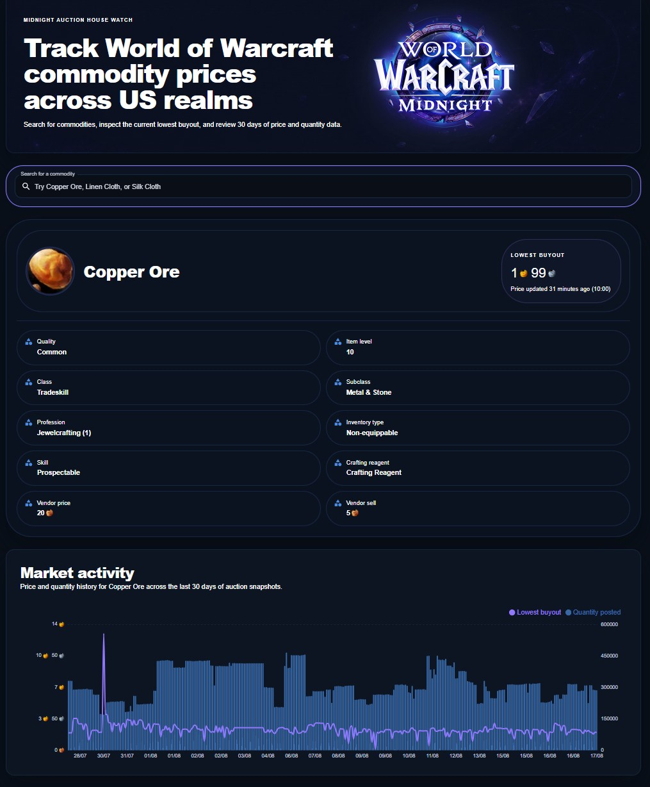
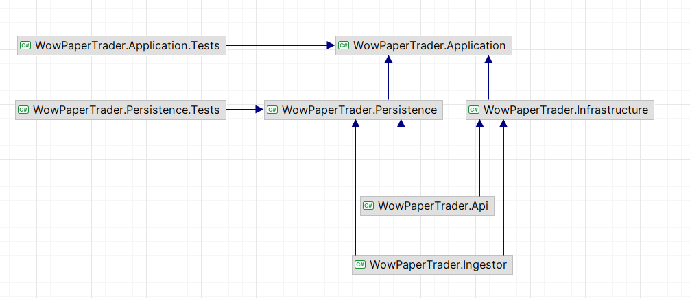

# WowPaperTrader

[View the hosted project](https://www.goblineconomics.com/)

WowPaperTrader is a full-stack World of Warcraft commodity auction analytics application. It collects region-wide WoW Retail auction snapshots from Blizzard's API, enriches observed item IDs with item metadata and media, stores the results in PostgreSQL, and presents current pricing plus 30-day market history through a .NET API and React frontend.

The React frontend is hosted on Vercel. The containerized API and PostgreSQL database run on a private VPS behind Caddy, with GitHub Actions providing the tested deployment path for both parts of the application.

The repository currently delivers the market-data foundation of the wider paper-trading idea described in [Requirements.md](Requirements.md). User accounts, portfolios, and simulated trades are not implemented yet.

## Demo Screenshot



## What It Does

- searches known commodities by name, ranking exact and prefix matches before other results
- displays Blizzard item metadata, item media, and the lowest unit price from the latest stored snapshot
- charts the lowest unit price and total quantity posted for each snapshot from the last 30 days
- ingests the US WoW Retail commodity auction feed as an atomic snapshot
- discovers auctioned item IDs without metadata and enriches them through Blizzard's item and media APIs
- records ingestion lifecycle state and failure details
- keeps write paths in EF Core and read-optimized queries in Dapper
- exposes a read-only, rate-limited REST API with CORS and aggregate and database health endpoints
- provides PostgreSQL integration tests backed by disposable Testcontainers databases
- includes container images, Docker Compose services, Caddy configuration, and GitHub Actions deployment assets

Auction prices are stored as copper. Commodity auctions are region-wide, so this project does not currently model individual realms or connected realms.

## Technology Stack

| Area                | Technology                                                         |
| ------------------- | ------------------------------------------------------------------ |
| API and ingestion   | C# 14, .NET 10, ASP.NET Core                                       |
| Application design  | Layered architecture with CQRS-style commands and queries          |
| Write persistence   | Entity Framework Core 10                                           |
| Read persistence    | Dapper 2                                                           |
| Database            | PostgreSQL through Npgsql; provided containers use PostgreSQL 18   |
| Frontend            | React 19, TypeScript 6, Vite 8                                     |
| UI and server state | Material UI 9, TanStack React Query 5, Axios, Recharts             |
| Backend testing     | xUnit, FluentAssertions, Testcontainers, Respawn                   |
| Operations          | Docker Compose, Caddy, GitHub Actions, GHCR, Azure Static Web Apps |

## Architecture



The dependency direction is kept deliberately simple:

```text
API / Ingestor
    -> Application contracts and use cases
    -> Persistence implementations
    -> Infrastructure adapters

Persistence -> Application
Infrastructure -> Application
```

`WowPaperTrader.Application` owns the commands, queries, contracts, response models, and ingestion entities. `WowPaperTrader.Persistence` and `WowPaperTrader.Infrastructure` implement the database and Blizzard API boundaries, while the API and ingestor projects act as composition roots.

### Solution Layout

| Project or directory               | Responsibility                                                                                       |
| ---------------------------------- | ---------------------------------------------------------------------------------------------------- |
| `WowPaperTrader.Api`               | Read-only ASP.NET Core API, dependency injection, CORS, rate limiting, Swagger, and health endpoints |
| `WowPaperTrader.Application`       | CQRS-style read/write features, contracts, handlers, response models, and ingestion entities         |
| `WowPaperTrader.Infrastructure`    | Battle.net OAuth, Blizzard HTTP clients, DTOs, adapters, and contract mapping                        |
| `WowPaperTrader.Persistence`       | EF Core context and migrations, write repositories, Dapper read services, and database helpers       |
| `WowPaperTrader.Ingestor`          | One-shot auction and metadata ingestion modes intended to be run by an external scheduler            |
| `WowPaperTrader.Persistence.Tests` | PostgreSQL repository, query, and schema integration tests                                           |
| `WowPaperTrader.Application.Tests` | Application test project scaffold; it does not contain test cases yet                                |
| `WowPaperTrader.Frontend`          | React single-page application for search, item details, and market history                           |
| `docker` and `compose*.yml`        | PostgreSQL roles, runtime services, migration job, and local/production image selection              |
| `scripts`                          | Ingestor runner, deployment helpers, and maintenance utilities                                       |

## Runtime Flows

### Auction Ingestion

1. The ingestor starts in `auctions` mode.
2. `PostAuctionDataCommandHandler` creates an `IngestionRun`.
3. Infrastructure obtains a Battle.net client-credentials token and calls Blizzard's US commodity auction endpoint.
4. The response is mapped into application-owned snapshot records.
5. `CommodityAuctionRepository` saves the snapshot and all auction rows in one PostgreSQL transaction.
6. The run is marked `Finished`, `Failed`, or `Cancelled`.

Each one-shot auction job has a 50-minute timeout and returns a process exit code so it can be supervised by Task Scheduler, cron, a container job, or another external scheduler. The repository does not run a permanent hourly background service.

### Metadata Enrichment

The `metadata` ingestor mode runs independently of auction ingestion. It should be scheduled after an `auctions` run so that newly observed item IDs are available, then it:

1. finds distinct auction item IDs missing from `ItemMetaData`
2. fetches item metadata and item media from Blizzard's `static-us` namespace
3. skips and logs Blizzard 404 responses and per-item HTTP failures
4. saves the successfully mapped metadata records through EF Core

The metadata job has its own three-hour timeout because it can make multiple Blizzard API calls for every new item. Auction and metadata schedules remain separate so frequent snapshots do not have to wait for the slower enrichment process.

### Read Path

The React application calls the API through a shared Axios client. React Query manages search, selected-item, and price-history server state. API controllers validate inputs, dispatch query handlers, and use Dapper read services to shape results directly from PostgreSQL.

## Data Model

| Table                       | Purpose                                                                                   |
| --------------------------- | ----------------------------------------------------------------------------------------- |
| `IngestionRuns`             | Tracks ingestion start, completion, status, and failure details                           |
| `CommodityAuctionSnapshots` | Stores fetch time, source endpoint, and its ingestion run                                 |
| `CommodityAuctions`         | Stores item ID, quantity, unit price, and time-left rows for a snapshot                   |
| `ItemMetaData`              | Stores Blizzard item details, profession fields, vendor values, media URL, and fetch time |

The schema indexes snapshot timestamps and the auction `(ItemId, CommodityAuctionSnapshotId)` lookup used by the read queries.

## API

The item API is rooted at `/api/v1/items`.

| Method and route                             | Behavior                                                                                |
| -------------------------------------------- | --------------------------------------------------------------------------------------- |
| `GET /api/v1/items?itemName={name}`          | Returns up to five case-insensitive name matches with item IDs and image URLs           |
| `GET /api/v1/items/{itemId}`                 | Returns item metadata and the lowest price from the latest snapshot                     |
| `GET /api/v1/items/{itemId}/auctions/lowest` | Returns the lowest unit price for the item in the latest snapshot                       |
| `GET /api/v1/items/{itemId}/price-history`   | Returns per-snapshot lowest price and total quantity for the last 30 days, oldest first |
| `GET /health`                                | Runs all registered health checks; this currently includes the PostgreSQL connection    |
| `GET /health/database`                       | Runs the PostgreSQL health check used to verify a production deployment                 |

Invalid or missing inputs return `400 Bad Request`. The item metadata and latest-price endpoints return `404 Not Found` when the item is absent from the latest snapshot. Price history returns `200 OK` with an empty `priceQuantityResponses` collection when no history exists.

Example price-history response:

```json
{
  "itemId": 2770,
  "priceQuantityResponses": [
    {
      "commodityAuctionSnapshotId": 42,
      "fetchedAtUtc": "2026-08-16T03:00:00Z",
      "lowestUnitPrice": 72500,
      "totalQuantityPosted": 18420
    }
  ]
}
```

In Development, Swagger UI is available at `/swagger`. The API requires at least one configured CORS origin and applies a global fixed-window limit of 100 requests per minute.

## Local Development

Run commands from the repository root unless a step says otherwise.

### Prerequisites

- .NET 10 SDK
- Node.js and npm compatible with the checked-in lockfile
- PostgreSQL accessible from the host machine
- Docker Desktop for the PostgreSQL integration tests
- Blizzard API client credentials for ingestion
- `dotnet-ef` 10.0.9 for applying migrations

Install the matching EF Core CLI if needed:

```powershell
dotnet tool install --global dotnet-ef --version 10.0.9
```

### 1. Configure PostgreSQL

Create an empty PostgreSQL database and provide its connection string to both backend hosts. The checked-in Development settings use a local `wowpapertrader` database, but environment variables can override them without changing tracked files:

```powershell
$env:ConnectionStrings__WowPaperTrader = "Host=localhost;Port=5432;Database=wowpapertrader;Username=<username>;Password=<password>"
```

Apply the migration:

```powershell
dotnet ef database update --project .\WowPaperTrader.Persistence\WowPaperTrader.Persistence.csproj --startup-project .\WowPaperTrader.Api\WowPaperTrader.Api.csproj
```

### 2. Configure Blizzard Credentials

Only the ingestor calls Blizzard. Store its credentials in .NET user secrets:

```powershell
dotnet user-secrets set "Blizzard:ClientId" "<client-id>" --project .\WowPaperTrader.Ingestor\WowPaperTrader.Ingestor.csproj
dotnet user-secrets set "Blizzard:ClientSecret" "<client-secret>" --project .\WowPaperTrader.Ingestor\WowPaperTrader.Ingestor.csproj
```

The default API base URL targets the US WoW Retail API. It can be overridden with `WowApi__BaseUrl`.

### 3. Load Auction and Metadata Data

Run an auction snapshot only:

```powershell
dotnet run --project .\WowPaperTrader.Ingestor\WowPaperTrader.Ingestor.csproj -- auctions
```

Enrich every observed item ID that is still missing metadata:

```powershell
dotnet run --project .\WowPaperTrader.Ingestor\WowPaperTrader.Ingestor.csproj -- metadata
```

The `metadata` mode does not fetch an auction snapshot. Run `auctions` first on a new database, then run `metadata`; item search is unavailable until metadata has been loaded successfully.

### 4. Run the API

The Development CORS configuration already allows Vite's default `http://localhost:5173` origin. Override it when using a different frontend origin:

```powershell
$env:Cors__AllowedOrigins__0 = "http://localhost:5173"
dotnet run --project .\WowPaperTrader.Api\WowPaperTrader.Api.csproj
```

The default Development addresses are:

- `http://localhost:5091`
- `https://localhost:7033`

### 5. Run the Frontend

Create `WowPaperTrader.Frontend/.env.local` with an API base URL that includes the API version prefix:

```dotenv
VITE_API_BASE_URL=http://localhost:5091/api/v1
```

Then install and start the frontend:

```powershell
Set-Location .\WowPaperTrader.Frontend
npm ci
npm run dev
```

## Configuration Reference

| Setting                             | Used by            | Purpose                                                                        |
| ----------------------------------- | ------------------ | ------------------------------------------------------------------------------ |
| `ConnectionStrings__WowPaperTrader` | API and ingestor   | PostgreSQL connection string                                                   |
| `Cors__AllowedOrigins__0`           | API                | First allowed frontend origin; use additional numeric entries for more origins |
| `Blizzard__ClientId`                | Ingestor           | Battle.net OAuth client ID                                                     |
| `Blizzard__ClientSecret`            | Ingestor           | Battle.net OAuth client secret                                                 |
| `WowApi__BaseUrl`                   | Ingestor           | Blizzard data API base URL                                                     |
| `VITE_API_BASE_URL`                 | Frontend build     | Versioned API base URL, such as `http://localhost:5091/api/v1`                 |
| `CADDY_SITE_ADDRESS`                | Caddy              | Local address or production API domain                                         |
| `IMAGE_TAG`                         | Production Compose | GHCR image tag, normally `latest` or a commit SHA for rollback                 |

Container-specific templates are provided in `.env.api.example`, `.env.ingestor.example`, `.env.postgres.example`, `.env.caddy.example`, and `.env.production.example`. Real `.env.*` files are ignored and must not be committed.

## Tests and Checks

Run the .NET test suite from the repository root:

```powershell
dotnet test .\WowPaperTrader.sln
```

`WowPaperTrader.Persistence.Tests` starts a real PostgreSQL 18 container, creates the current EF Core model, and resets data between tests with Respawn. Docker must be running. The suite covers snapshot and metadata writes, latest-price queries, missing metadata IDs, search behavior, 30-day price/quantity history, and schema shape.

The frontend has Jest and Testing Library configured but does not currently contain test files. Use the production build and linter as the available frontend checks:

```powershell
Push-Location .\WowPaperTrader.Frontend
npm run build
npm run lint
Pop-Location
```

## Continuous Integration and Deployment Pipeline

The backend workflow uses the test job as a deployment gate. Pull requests are validated without publishing artifacts, while successful runs for `main` continue through commit-SHA-tagged image publication, VPS deployment, and a live database health check. The frontend has a separate path-filtered workflow so it can be built and deployed independently.

```mermaid
flowchart TD
    subgraph Backend[Backend pipeline]
        PullRequest[Pull request to main] --> DotNetChecks[Restore, Release build, and .NET tests]
        MainPush[Push to main] --> DotNetChecks
        ManualBackend[Manual run on main] --> DotNetChecks
        DotNetChecks -->|Pull request| ValidationComplete[Validation complete]
        DotNetChecks -->|Push or manual run on main| PublishImages[Build API and ingestor images]
        PublishImages --> Ghcr[Publish latest and commit SHA tags to GHCR]
        Ghcr --> VpsConnection[Connect to the VPS through Tailscale and SSH]
        VpsConnection --> ProductionDeploy[Deploy the exact commit and image SHA]
        ProductionDeploy --> Migration[Validate configuration, pull images, and apply migrations]
        Migration --> StartServices[Start the API and Caddy]
        StartServices --> HealthCheck[Verify /health/database]
    end

    subgraph Frontend[Frontend pipeline]
        FrontendPush[Frontend change on main] --> FrontendBuild[Build with Vite]
        ManualFrontend[Manual run] --> FrontendBuild
        FrontendBuild --> StaticWebApp[Deploy to Azure Static Web Apps]
    end
```



### Backend pipeline

The backend workflow, [`.github/workflows/publish-images.yml`](.github/workflows/publish-images.yml), runs for pull requests targeting `main`, pushes to `main`, and manual dispatches. Its jobs execute in this order:

1. **Test** checks out the repository, restores the .NET 10 solution, builds it in Release mode, and runs the full .NET test suite. Pull-request runs stop here.
2. **Publish** runs only for `main` after the tests pass. It builds the API and ingestor Dockerfiles and publishes each image to GHCR with both `latest` and `${{ github.sha }}` tags.
3. **Deploy** connects to the private network through Tailscale, uses SSH to synchronize the VPS checkout to the exact workflow commit, and invokes [`scripts/deploy-production.sh`](scripts/deploy-production.sh) with that commit SHA as `IMAGE_TAG`.
4. **Verify** requests `https://api.goblineconomics.com/health/database`. A failed PostgreSQL health check fails the deployment job.

The production script validates the Compose configuration and the active Caddy configuration before changing services. It pulls the API, migrator, and ingestor images, waits for PostgreSQL, stops the API while the EF Core migrations bundle runs, starts the updated API and Caddy, and reloads the reverse-proxy configuration.

Backend workflow runs use a per-ref concurrency group and do not cancel an in-progress deployment. Commit-SHA image tags keep deployed artifacts traceable and provide a stable image reference for rollback.

### Frontend pipeline

The frontend workflow, [`.github/workflows/deploy-frontend.yml`](.github/workflows/deploy-frontend.yml), runs when `WowPaperTrader.Frontend` or the workflow itself changes on `main`, and it can also be started manually. Azure's deployment action runs `npm run build` with the repository's `VITE_API_BASE_URL` variable and publishes the generated `dist` directory to Azure Static Web Apps.

## Containers and Deployment

The base `compose.yml` defines PostgreSQL, an EF Core migration job, the API, a one-shot ingestor job, and Caddy. PostgreSQL initialization creates separate least-privilege roles:

- `wow_api_user` receives read-only table access
- `wow_ingestor_user` receives read/write table and sequence access
- `postgres_admin` owns migrations and administrative operations

`compose.override.yml` selects locally built images, while `compose.production.yml` selects versioned images from GHCR. The API image also contains an EF Core migrations bundle used by the `migrator` service. Caddy exposes the API and rejects methods other than `GET`, `HEAD`, and `OPTIONS`.

The production deployment script is called by the backend pipeline described above. Ingestion scheduling remains an external operational responsibility; `scripts/run-ingestor.ps1` is the Windows/Docker wrapper supplied for separate `auctions` and `metadata` scheduled runs.

## Current Limitations

- only the US WoW Retail commodity feed and `en_US` locale are supported
- commodity data is region-wide rather than realm-specific
- authentication, user accounts, portfolios, and simulated trading are still roadmap items
- ingestion is one-shot and depends on an external scheduler
- old auction data is not deleted automatically; the history query only filters its response to 30 days
- the existing manual retention script still uses legacy SQL Server syntax and must not be run against PostgreSQL
- Blizzard HTTP calls do not have retry or backoff policies
- metadata enrichment is sequential and capped by the job's three-hour timeout
- `ItemMetaData.ItemId` does not currently have a unique database constraint
- application-layer and frontend test coverage have not been added yet

## Disclaimer

This is a personal educational project and is not affiliated with or endorsed by Blizzard Entertainment. World of Warcraft and Blizzard Entertainment are trademarks or registered trademarks of Blizzard Entertainment, Inc.

## License

No license file is present. All rights are reserved by default.
